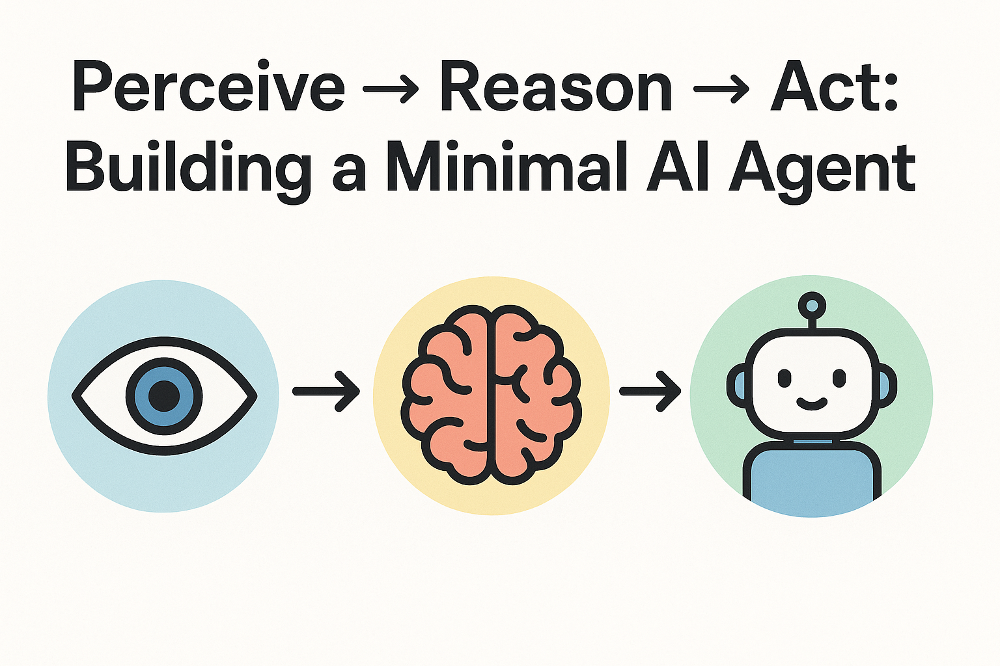

# Perceive → Reason → Act: Building a Minimal AI Agent

## Introduction

On July 17th, 2025, OpenAI released ChatGPT Agent Mode capable of performing tasks using its own virtual computer. Agentic AI is transforming how we interact with software, moving from simple Q&A to autonomous task execution. As someone who's been fascinated by AI's potential since ChatGPT's early days, I knew I had to understand how these agents actually work under the hood. So on a random Saturday, I decided to build my own AI agent from scratch!

In this article, I'll walk you through creating a production-ready documentation agent that follows the classic **Perceive → Reason → Act** pattern. By the end, you'll have a working CLI tool that can analyze Python code and generate professional documentation using modern LLMs.

---
*TL;DR: Check out my GitHub Repo [here](https://github.com/TJLSmith0831/ai-agent-learning)*
---

## The Agent Architecture

Every effective AI agent follows three core steps:

1. **Perceive**: Gather and understand information from the environment
2. **Reason**: Process that information and decide what to do
3. **Act**: Execute the decision and produce results

For my documentation agent, this translates to:
- **Perceive**: Parse Python files and extract function signatures, parameters, and existing docstrings
- **Reason**: Analyze the code structure and determine what documentation needs to be generated
- **Act**: Call an LLM to generate professional documentation in the desired format

## Building the Foundation: Code Perception

The first challenge was teaching my agent to "see" code structure. Python's built-in `ast` (Abstract Syntax Tree) module became my best friend:

```python
def extract_functions(file_path: str) -> List[FunctionInfo]:
    """
    Extract function information from a Python file.

    :param file_path: Path to the Python file to parse
    :type file_path: str
    :returns: List of function information objects
    :rtype: List[FunctionInfo]
    :raises FileNotFoundError: If the specified file does not exist
    :raises SyntaxError: If the Python file has syntax errors
    """
    try:
        with open(file_path, "r", encoding="utf-8") as f:
            source_code = f.read()

        # Parse the source code into an Abstract Syntax Tree
        tree = ast.parse(source_code)
        source_lines = source_code.splitlines()

        functions = []

        # Walk through all nodes in the AST
        for node in ast.walk(tree):
            if isinstance(node, ast.FunctionDef):
                # Extract function information
                func_name = node.name

                # Extract argument names
                arg_names = []
                for arg in node.args.args:
                    arg_names.append(arg.arg)

                # Get source code for this function
                start_line = node.lineno - 1  # AST uses 1-based line numbers
                end_line = node.end_lineno if node.end_lineno else start_line + 1
                func_source = "\n".join(source_lines[start_line:end_line])

                # Get docstring if it exists
                docstring = ast.get_docstring(node=node)

                # Create function info object
                func_info = FunctionInfo(
                    name=func_name,
                    args=arg_names,
                    source_code=func_source,
                    line_number=node.lineno,
                    docstring=docstring,
                )

                functions.append(func_info)

        return functions

    except SyntaxError as e:
        print(f"❌ Syntax error in {file_path}: {e}")
        return []
    except FileNotFoundError:
        print(f"❌ File not found: {file_path}")
        return []
    except Exception as e:
        print(f"❌ Error parsing {file_path}: {e}")
        return []
```

This gives the agent eyes to see function signatures, parameters, return types, and existing documentation. No complex parsing libraries needed—just Python's standard library doing the heavy lifting.

## The Reasoning Engine: Making Sense of Code

Once the agent can perceive code structure, it needs to reason about what documentation to generate. This is where the magic happens:

```python
def reason(self, function: FunctionInfo) -> str:
    """
    Build context and generate prompt for LLM documentation generation.

    :param function: Function information to generate documentation for
    :type function: FunctionInfo
    :returns: Formatted prompt for LLM
    :rtype: str
    """
    prompt = f"""
    You are a Python docstring generator.

    Goal:
    Return exactly the function declaration line and its docstring in {self.doc_format.value} 
    style.
    Do not include any function body statements. Do not add any text before or after.
    Do not wrap the output in code fences.

    Source function (for analysis only; do not copy the body):
    <<<SOURCE
    {function.source_code}
    SOURCE>>>

    Style guide (authoritative example; follow its sections and syntax exactly):
    <<<STYLE
    {self.doc_format_example}
    STYLE>>>

    Strict output contract:
    1) Preserve the original declaration EXACTLY (decorators, async, name, parameters, defaults, type hints, return type).
    2) Immediately follow it with a correctly indented {self.doc_format.value} docstring.
    3) Docstring must include:
    - A concise one-line summary.
    - A parameters section and a returns section formatted per {self.doc_format.value}.
    4) If there are no parameters or no return value, handle that according to the style in the STYLE block (omit or mark None, as appropriate).
    5) Do not invent types that are not present or reasonably inferable; prefer what is annotated.
    6) Any example usage must remain inside the docstring as an Examples section; never emit code outside the docstring.
    7) Output only the declaration and its docstring—nothing else.
    """

    return prompt.strip()
```

The reasoning step crafts intelligent prompts that give context to the LLM, ensuring generated documentation is accurate and useful rather than generic. 

### The One-Shot Approach

Rather than asking the LLM to generate documentation from scratch, I use a **one-shot learning approach**. The agent provides the LLM with a complete style example (`self.doc_format_example`) showing exactly how documentation should look for the chosen format (RST, Google, NumPy, etc.). This ensures consistent formatting and proper section structure every time—no need for multiple iterations or format corrections.

## Taking Action: LLM Integration

The final step connects to modern LLMs to generate the actual documentation. I built support for multiple providers:

```python
def act(self, prompt: str) -> str:
    """
    Generate documentation using the configured LLM.

    :param prompt: Formatted prompt for documentation generation
    :type prompt: str
    :returns: Generated documentation text
    :rtype: str
    """

    try:
        # Real LLM calls
        if self.llm_type == LLMClient.OPENAI:
            response = self.llm_client.chat.completions.create(
                model="gpt-3.5-turbo",
                messages=[{"role": "user", "content": prompt}],
                max_tokens=300,
            )
            return response.choices[0].message.content
        elif self.llm_type == LLMClient.ANTHROPIC:
            response = self.llm_client.messages.create(
                model="claude-3-5-sonnet-20240620",
                max_tokens=300,
                messages=[{"role": "user", "content": prompt}],
            )
            return response.content[0].text
        else:
            raise ValueError(f"Unsupported LLM client: {self.llm_type}")

    except Exception as e:
        return f"❌ Error calling LLM: {e}"
```

## From Script to CLI: Making It Production-Ready

A good AI agent needs a great interface. I built progressively sophisticated CLI tools, evolving from basic argparse to rich interactive experiences:

**Phase 1: Basic CLI with argparse**
```bash
python cli_agent.py my_script.py --llm openai --format markdown
```

**Phase 2: Interactive CLI with Rich**
```bash
cd doc_agent
python interactive_cli.py
```

```
╭─────────────────────────────────────────╮
│ 🤖 Interactive AI Documentation Generator │
╰─────────────────────────────────────────╯
==================================================
Available Python files:
```

Beautiful progress bars, colored output, and interactive prompts that make the tool feel professional.

**Phase 3: Configuration Management**
```bash
ai-doc config --set default_llm anthropic
ai-doc config --show
```

Persistent settings with proper configuration hierarchy: environment variables → CLI args → config file → defaults.

## The Results

The final agent produces documentation like this:

**Input**: A Python function with minimal documentation
```python
def calculate_total(items, tax_rate):
    total = sum(items)
    return total * (1 + tax_rate)
```

**Output**: Professional RST, Markdown, or Google-style docstrings complete with parameter descriptions, return values, and usage examples:
```python
def calculate_total(items, tax_rate):
    """
    Calculate the total cost of items including tax.

    :param items: List of item prices to sum
    :type items: List[float]
    :param tax_rate: Tax rate as a decimal (e.g., 0.08 for 8%)
    :type tax_rate: float
    :returns: Total cost including tax
    :rtype: float
    """
    total = sum(items)
    return total * (1 + tax_rate)
```

What started as a weekend experiment became a production-ready tool that I now use daily for documenting my own projects.

## Key Lessons Learned

1. **Start Simple**: Begin with the core agent pattern before adding CLI bells and whistles
2. **Test Often**: After every change, run your agent on real code to catch issues early  
3. **LLM Prompting Matters**: Specific, contextual prompts produce dramatically better results than generic ones

## What's Next?

This agent opens up fascinating possibilities:
- **Multi-language Support**: Extend to JavaScript, TypeScript, and other languages
- **Integration**: VS Code extensions, GitHub Actions, pre-commit hooks
- **Intelligence**: Code quality scoring and improvement suggestions
- **Collaboration**: Team documentation standards and templates

## Try It Yourself [Here](https://github.com/TJLSmith0831/ai-agent-learning)

The complete implementation is open source and production-ready. The project includes:
- Working agent with Perceive → Reason → Act pattern
- Multiple CLI interfaces from basic to advanced
- LLM integration for OpenAI, Anthropic, and local models
- Comprehensive testing and configuration management

Building AI agents isn't magic—it's systematic application of the Perceive → Reason → Act pattern combined with thoughtful engineering. Start with something simple, iterate quickly, and you'll be amazed what you can build in a weekend.
